# TOTP Auth for Cardputer ADV

  
  
  

---

### 🇷🇺 [Русский](#русский) | 🇺🇸 [English](#english)

---

## 🇷🇺 Русский

Автономное приложение для генерации TOTP-кодов на устройстве **M5Stack Cardputer ADV**. Позволяет хранить зашифрованные данные на SD-карте и вводить коды на компьютер через USB-соединение (эмуляция клавиатуры).
⚠️ Внимание: Данные шифруются алгоритмом AES-256 (PBKDF2, 10,000 итераций). Функция восстановления пароля отсутствует. Если вы забудете мастер-пароль, доступ к вашим аккаунтам будет невозможен.

### 🖼 Интерфейс

<table align="center">
<tr>
<td align="center">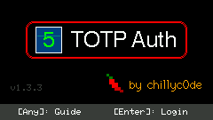</td>
<td align="center">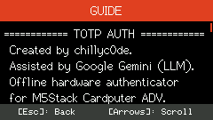</td>
<td align="center">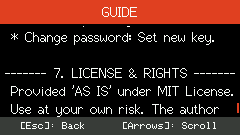</td>
<td align="center">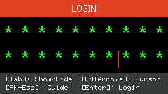</td>
</tr>
<tr>
<td align="center">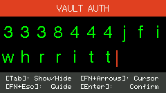</td>
<td align="center">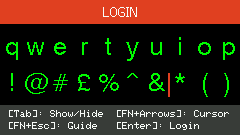</td>
<td align="center">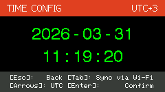</td>
<td align="center">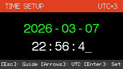</td>
</tr>
<tr>
<td align="center">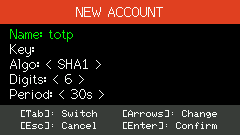</td>
<td align="center">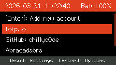</td>
<td align="center">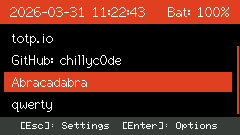</td>
<td align="center">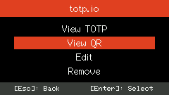</td>
</tr>
<tr>
<td align="center">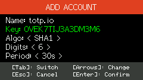</td>
<td align="center">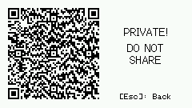</td>
<td align="center">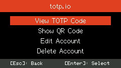</td>
<td align="center">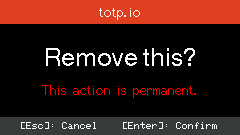</td>
</tr>
<tr>
<td align="center">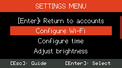</td>
<td align="center">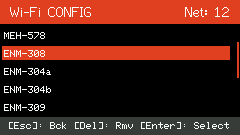</td>
<td align="center"></td>
<td align="center">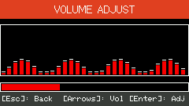</td>
</tr>
<tr>
<td align="center">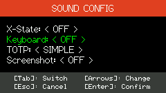</td>
<td align="center">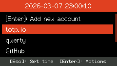</td>
<td align="center">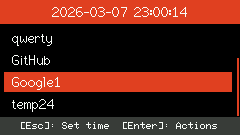</td>
<td align="center">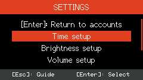</td>
</tr>
</table>

### 🚀 Установка

**Способ 1: M5Launcher (Рекомендуется)**

1. Установите [M5Launcher](https://github.com/bmorcelli/Launcher) от **bmorcelli** на ваше устройство.
2. Скачайте [TOTP-Auth-for-Cardputer-ADV-vX.X.X.bin](https://github.com/chillyc0de/TOTP-Auth-for-Cardputer-ADV/releases) в данном репозитории или через утилиту [M5Burner](https://docs.m5stack.com/en/uiflow/m5burner/intro).
3. Поместите скачанный файл на SD-карту и загрузите прошивку через [M5Launcher](https://github.com/bmorcelli/Launcher).

**Способ 2: M5Burner**

1. Скачайте [M5Burner](https://docs.m5stack.com/en/uiflow/m5burner/intro).
2. Выберите категорию **Cardputer**.
3. Найдите **TOTP Auth for Cardputer ADV** и нажмите кнопку **Burn**.

**Способ 3: Сборка через PlatformIO**

1. Установите [Visual Studio Code](https://code.visualstudio.com/Download) и расширение [PlatformIO](https://platformio.org/install/ide?install=vscode).
2. Клонируйте данный репозиторий.
3. Для компиляции установите следующие библиотеки:

- [M5Cardputer](https://github.com/m5stack/M5Cardputer) — Официальная библиотека от [**M5Stack**](https://github.com/m5stack).
- [ArduinoJson](https://github.com/bblanchon/ArduinoJson) — Мощный JSON-парсер от [**Benoit Blanchon**](https://github.com/bblanchon).
- [TOTP Library](https://github.com/lucadentella/TOTP-Arduino) — Реализация алгоритма TOTP от [**Luca Dentella**](https://github.com/lucadentella).
- [QRCode](https://github.com/ricmoo/QRCode) — Генератор QR-кодов от [**Richard Moore**](https://github.com/ricmoo).
- [AESLib](https://github.com/suculent/thinx-aes-lib) — Библиотека шифрования AES от [**Suculent**](https://github.com/suculent).

4. Нажмите **Build** и **Upload** для компиляции и загрузки прошивки через USB COM PORT.

### 👥 Авторы и участие

- [**chillyc0de**](https://github.com/chillyc0de) — Идея, общая логика приложения, интерфейс и работа с оборудованием, рефакторинг.
- [**Google Gemini** (LLM)](https://gemini.google.com) — Оптимизация кода, расчеты математических моделей анимации, локализация.

### 📄 Лицензия

Распространяется под лицензией **MIT**.
Проект использует сторонние библиотеки, список которых и их лицензии доступны в файле [NOTICE.txt](https://github.com/chillyc0de/TOTP-Auth-for-Cardputer-ADV/blob/main/NOTICE.txt).

---

## 🇺🇸 English

Standalone TOTP authenticator for **M5Stack Cardputer ADV**. It provides encrypted SD storage and automatic code entry via USB-HID (keyboard emulation).
⚠️ Warning: Data is encrypted using AES-256 (PBKDF2, 10,000 iterations). There is no password recovery. If you forget your Master Password, your data is lost forever.

### 🖼 Interface

<table align="center">
<tr>
<td align="center"></td>
<td align="center"></td>
<td align="center"></td>
<td align="center"></td>
</tr>
<tr>
<td align="center"></td>
<td align="center"></td>
<td align="center"></td>
<td align="center"></td>
</tr>
<tr>
<td align="center"></td>
<td align="center"></td>
<td align="center"></td>
<td align="center"></td>
</tr>
<tr>
<td align="center"></td>
<td align="center"></td>
<td align="center"></td>
<td align="center"></td>
</tr>
<tr>
<td align="center"></td>
<td align="center"></td>
<td align="center"></td>
<td align="center"></td>
</tr>
<tr>
<td align="center"></td>
<td align="center"></td>
<td align="center"></td>
<td align="center"></td>
</tr>
</table>

### 🚀 Installation

**Method 1: M5Launcher (Recommended)**

1. Install [M5Launcher](https://github.com/bmorcelli/Launcher) by **bmorcelli** on your device.
2. Download [TOTP-Auth-for-Cardputer-ADV-vX.X.X.bin](https://github.com/chillyc0de/TOTP-Auth-for-Cardputer-ADV/releases) from this repository or via [M5Burner](https://docs.m5stack.com/en/uiflow/m5burner/intro).
3. Place the downloaded file on your SD card and load the firmware using [M5Launcher](https://github.com/bmorcelli/Launcher).

**Method 2: M5Burner**

1. Download [M5Burner](https://docs.m5stack.com/en/uiflow/m5burner/intro).
2. Select the **Cardputer** category.
3. Search for **TOTP Auth for Cardputer ADV** and click the **Burn** button.

**Method 3: Build via PlatformIO**

1. Install [Visual Studio Code](https://code.visualstudio.com/Download) and the [PlatformIO](https://platformio.org/install/ide?install=vscode) extension.
2. Clone this repository.
3. To compile, install the following libraries:

- [M5Cardputer](https://github.com/m5stack/M5Cardputer) — Official library by [**M5Stack**](https://github.com/m5stack).
- [ArduinoJson](https://github.com/bblanchon/ArduinoJson) — Powerful JSON parser by [**Benoit Blanchon**](https://github.com/bblanchon).
- [TOTP Library](https://github.com/lucadentella/TOTP-Arduino) — TOTP algorithm implementation by [**Luca Dentella**](https://github.com/lucadentella).
- [QRCode](https://github.com/ricmoo/QRCode) — QR code generator by [**Richard Moore**](https://github.com/ricmoo).
- [AESLib](https://github.com/suculent/thinx-aes-lib) — AES encryption library by [**Suculent**](https://github.com/suculent).

4. Click **Build** and **Upload** to compile and flash the firmware via USB COM PORT.

### 👥 Authors & Roles

- [**chillyc0de**](https://github.com/chillyc0de) — Concept, application logic, UI design, hardware integration, refactoring.
- [**Google Gemini** (LLM)](https://gemini.google.com) — Code optimization, animation math modeling, localization.

### 📄 License

Distributed under the **MIT License**.
This project uses third-party libraries. A full list of components and their licenses can be found in the [NOTICE.txt](https://github.com/chillyc0de/TOTP-Auth-for-Cardputer-ADV/blob/main/NOTICE.txt) file.
